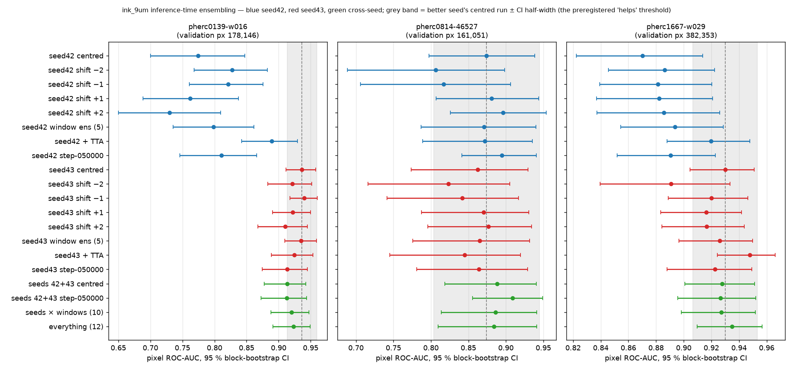

# Pilot result — inference-time ensembling for ink_9um on pherc0139-w016 (2026-09-28)

Preregistered 2026-09-28 before any run ([PREREGISTRATION.md](PREREGISTRATION.md)); every arm below was in the plan. One validation segment; treat as a pilot. **Extended the same day to all three validation segments — see [Extension](#extension-28-sep-2026-same-day-the-other-two-validation-segments) below: the headline holds on 3/3 segments, and one finding sharpens.**

## Setup
- Segment `pherc0139-w016` = public `20250108000004-w029_2025010827` (PHerc. 0139), one of the three segments the released checkpoints report validation metrics on. Input built with the repo's own `prepare_9um_isotropic_input` from the public 2.399 µm volume (level 2, 4× z mean): 21 × 7020 × 7220, identical to the label canvas. Labels `ink_9um` (validation region 178,146 px; 41,253 ink px inside it).
- 14 inference runs on an RTX 2070 SUPER, true fp32 (`--amp-dtype default` on the #1890 branch), `--no-compile`, batch 4: ~95 s each, mirror-TTA runs ~245 s. Ensembles are means of the saved uint8 predictions (no extra inference).
- Metric: pixel ROC-AUC and AP over the validation region against `inklabels[Z=10] > 0`; 64-px block bootstrap, 1000 resamples, 95 % interval.

## Results (AUC [95 % CI], AP)
| arm | AUC | CI | AP |
|---|---|---|---|
| seed42 centred | 0.774 | 0.700–0.847 | 0.622 |
| seed42 shift −2 / −1 / +1 / +2 | 0.828 / 0.822 / 0.762 / 0.730 | | 0.689 / 0.675 / 0.597 / 0.561 |
| seed42 window ensemble (5) | 0.799 | 0.735–0.862 | 0.649 |
| seed42 + TTA mirror | **0.890** | 0.842–0.929 | 0.741 |
| seed42 step-050000 centred | 0.811 | 0.746–0.866 | 0.643 |
| **seed43 centred** | **0.937** | 0.912–0.958 | 0.817 |
| seed43 shift −2 / −1 / +1 / +2 | 0.921 / **0.940** / 0.922 / 0.910 | | 0.812 / 0.831 / 0.809 / 0.794 |
| seed43 window ensemble (5) | 0.935 | 0.910–0.959 | 0.827 |
| seed43 + TTA mirror | 0.925 | 0.889–0.954 | 0.801 |
| seed43 step-050000 centred | 0.913 | 0.874–0.945 | 0.759 |
| seed ensemble, centred (42+43) | 0.913 | 0.878–0.942 | 0.780 |
| seed ensemble, step-050000 | 0.913 | 0.873–0.943 | 0.776 |
| seeds × windows (10) | 0.920 | 0.888–0.948 | 0.797 |
| everything (12: + both TTA runs) | 0.923 | 0.891–0.949 | 0.802 |

## Reading it (preregistered rule: an arm helps if it beats the better seed's centred run by more than the CI half-width, ≈0.023)
1. **The seed is the whole story on this segment.** seed43 centred 0.937 vs seed42 centred 0.774 — a 0.16 AUC gap between two runs that differ only by the random seed. Nothing else in the study is that large.
2. **No arm beats seed43's single centred run.** Best is seed43 shift −1 at 0.940 (+0.004, inside the noise). Window averaging (0.935), TTA (0.925), seed averaging (0.913), and averaging everything (0.923) are all at or below it.
3. **Averaging seeds hurts when one seed is weak.** 42+43 centred = 0.913, below seed43 alone (0.937): the weaker model drags the mean down. "Run both seeds" is good advice for *choosing*, not for averaging.
4. **Window shifts and TTA are rescue tools, not boosts.** For the weak seed42 they help a lot (best shift +0.054, TTA +0.116 AUC); for the strong seed43 they do nothing or slightly hurt. The tutorial's "average over nearby windows" gives seed42 +0.025 — less than simply picking its best single shift.
5. **Depth sensitivity is asymmetric here:** both seeds prefer the window moved one or two slices *down* (−1/−2) over up, consistent with the labels sitting slightly above the render's centre.
6. **Step matters per seed:** seed42's step-050000 beats its step-075000 (0.811 vs 0.774); seed43's is the reverse (0.913 vs 0.937).

**Actionable:** on a new segment, spend the compute on trying the two seeds (and a couple of steps) at the centred window first; keep TTA and window averaging for when the best single run is still poor. Averaging across seeds is not a free win.

## Caveats
- One segment, in-distribution (PHerc. 0139). The follow-up covers `pherc0814-46527`, `pherc1667-w029` (done — see the Extension below) and the held-out PHerc0841 renders (#1867).
- Intervals are wide (±0.02 to ±0.07); only the seed gap and seed42's TTA/shift gains clear them.
- The runs used the #1890 branch (fp32) without #1891, so these TIFFs carry no provenance record; checkpoint, window and TTA per run are in each run's log (`Loaded … weights from …`, `Selected source layer indices=…`, `tta_mirror=…`) and in `run_w016_arms.sh`. The next round runs on a branch that includes both.
- Predictions are not published (they show text on a labelled segment; the licence keeps text revelations in the Discord). Numbers, scripts, logs and the figure are.

## Files
This folder: `results_w016.json`, `results_w016.txt`, `walltimes.txt`, `fig_w016_auc_by_arm.png`, `logs/`, and the scripts (`prep_w016.sh`, `run_w016_arms.sh`, `score_w016.py`, `score_all.sh`).

## Extension (28 Sep 2026, same day): the other two validation segments

Preregistered before any run ([PREREGISTRATION-EXTENSION.md](PREREGISTRATION-EXTENSION.md), commit 23ee1e5, 15:23 UTC; the first run started at 15:23:46 UTC): the same 14 arms, flags, metric, bootstrap and decision rule on `pherc0814-46527` (PHerc. 0814, public `20260226000000-46527_2um_try2`, canvas 2130 × 3455, validation region 161,051 px) and `pherc1667-w029` (Scroll 1667, public `20251212185248-w029_20251212185248662_flatboi`, 9500 × 7830, 382,353 px). Code: local branch `study-combined` = villa `main` 795ca2ba + #1890 + #1891, so these TIFFs carry their run record (`tiffcomment` prints it; each pipeline log shows one). Wall time on the RTX 2070 SUPER: 46527 ≈ 19 s per run (TTA ≈ 35 s), w029 ≈ 135 s (TTA ≈ 352 s). All tables are generated by `summarize_segments.py` from the three results files (`summary_3segments.md` has the per-segment raw tables).

### Q1 — does the seed effect replicate?

| segment | seed42 | seed43 | gap | half-width | clears? |
|---|---|---|---|---|---|
| pherc0139-w016 | 0.774 | 0.936 | +0.162 | 0.023 | yes |
| pherc0814-46527 | 0.874 | 0.863 | -0.012 | 0.071 | no |
| pherc1667-w029 | 0.870 | 0.930 | +0.060 | 0.023 | yes |

seed43 beats seed42 on two of the three segments (by 0.16 and 0.06 AUC, both outside the noise); on 46527 they tie. seed42 is never clearly the better one.

### Q2 — does any ensemble beat the better seed's single centred run?

| arm | pherc0139-w016 | pherc0814-46527 | pherc1667-w029 | mean Δ | segments cleared |
|---|---|---|---|---|---|
| seed42 window ensemble (5) | -0.138 | -0.003 | -0.036 | -0.059 | 0/3 |
| seed43 window ensemble (5) | -0.001 | -0.009 | -0.004 | -0.005 | 0/3 |
| seed42 + TTA mirror | -0.047 | -0.003 | -0.010 | -0.020 | 0/3 |
| seed43 + TTA mirror | -0.012 | -0.029 | +0.018 | -0.008 | 0/3 |
| seed ensemble, centred (42+43) | -0.023 | +0.014 | -0.002 | -0.004 | 0/3 |
| seed ensemble, step-050000 | -0.024 | +0.035 | -0.003 | +0.003 | 0/3 |
| seeds x windows (10) | -0.016 | +0.012 | -0.003 | -0.002 | 0/3 |
| everything (12) | -0.013 | +0.010 | +0.005 | +0.000 | 0/3 |

No arm clears the preregistered rule on any segment (0/3 for every ensemble). Every cross-seed ensemble's mean ΔAUC is within ±0.005 of zero. The closest call is seed43 + TTA on w029 (+0.018 against a 0.023 half-width).

### Q3 — who benefits from shifts and TTA?

| segment | seed | centred | best shift | window ens (5) | TTA | step-050000 |
|---|---|---|---|---|---|---|
| pherc0139-w016 | 42 | 0.774 | +0.053 | +0.025 | +0.116 | +0.037 |
| pherc0139-w016 | 43 | 0.936 | +0.004 | -0.001 | -0.012 | -0.023 |
| pherc0814-46527 | 42 | 0.874 | +0.022 | -0.003 | -0.003 | +0.020 |
| pherc0814-46527 | 43 | 0.863 | +0.014 | +0.002 | -0.017 | +0.001 |
| pherc1667-w029 | 42 | 0.870 | +0.016 | +0.023 | +0.050 | +0.020 |
| pherc1667-w029 | 43 | 0.930 | -0.010 | -0.004 | +0.018 | -0.007 |

TTA rescues the weaker seed on two of three segments (+0.116 on w016, +0.050 on w029; −0.003 on 46527) and is a coin flip for the stronger one (−0.012, −0.017, +0.018). Window shifts never exceed +0.05 and the preferred direction flips between segments (w016 down, 46527 up, w029 centred), so no fixed shift is a default; averaging the five windows is never better than the best single shift.

### A finding the pilot could not see: seed42's final checkpoint is its worst

seed42 step-050000 beats seed42 step-075000 on all three segments (+0.037, +0.020, +0.020 AUC); for seed43 the final step is as good or better (the earlier step scores −0.023, +0.001, −0.007). Three of three is consistent, but each gap sits inside its segment's interval — a strong hint, not a proof: if you run seed42, run its step-050000.

### Label-free: do the two seeds agree?

Post-hoc (the addendum in [PREREGISTRATION-EXTENSION.md](PREREGISTRATION-EXTENSION.md) was written after w016 and 46527 were scored and before w029's arms ran). Pearson r between the seed42 and seed43 centred predictions, from `seed_agreement.py`:

| segment | r (full canvas) | r (validation region) | seed ensemble − better seed |
|---|---|---|---|
| pherc0139-w016 | 0.80 | 0.65 | −0.023 |
| pherc0814-46527 | 0.91 | 0.92 | +0.014 |
| pherc1667-w029 | 0.80 | 0.76 | −0.002 |

The prediction for w029 was "r ≤ 0.8 → the seed ensemble falls below the better seed". r came out at 0.801 and the ensemble at −0.002: on the boundary on both counts, neither a confirmation nor a refutation. Two of three segments with r ≈ 0.8 had the better seed alone at or above the average; the one with r ≈ 0.9 had the average slightly ahead. One rule, three points — it needs more segments before anyone should act on it.

### What changes in the recommendation

- **Unchanged:** no inference-time ensemble in the tutorial's list beats the best single run on any of the three validation segments. Spend the compute on trying both seeds first.
- **Sharpened:** seed43 is the safer single choice (better on 2/3, tied on 1/3); if you run seed42, run its step-050000. Averaging the two seeds is a hedge that never wins by more than noise and loses 0.02 when one seed is weak.
- **TTA mirror** is worth one run when the best single result still looks poor; on the strong seed it is a coin flip.
- **Depth-window shifts** are segment-specific; averaging windows is not a substitute for trying a shift.

### Files and caveats

`pherc0814-46527/` and `pherc1667-w029/` hold each segment's results (JSON and text), wall times and `logs/` (14 run logs plus the prep and pipeline logs); `summary_3segments.md`, `seed_agreement.txt`, `fig_auc_by_arm_3seg.png`; scripts `prep_seg.sh`, `run_seg_pipeline.sh`, `summarize_segments.py`, `seed_agreement.py`, `fig_arms.py`. Predictions are not published (licence). Still three validation segments of the same training run — in-distribution for the model; the held-out PHerc0841 renders remain the October item. Intervals are ±0.02–0.07 (the 46527 region is small and its intervals wide). The seed-agreement rule is post-hoc.
