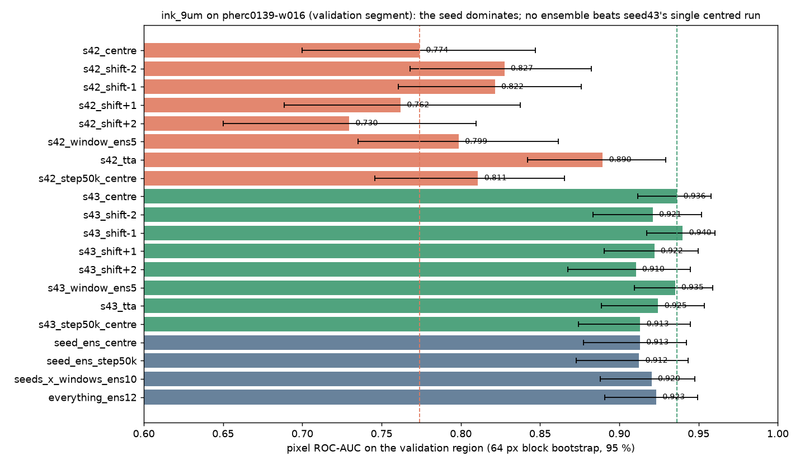

# Pilot result — inference-time ensembling for ink_9um on pherc0139-w016 (2026-09-28)

Preregistered 2026-09-28 before any run ([PREREGISTRATION.md](PREREGISTRATION.md)); every arm below was in the plan. One validation segment; treat as a pilot.

## Setup
- Segment `pherc0139-w016` = public `20250108000004-w029_2025010827` (PHerc. 0139), one of the three segments the released checkpoints report validation metrics on. Input built with the repo's own `prepare_9um_isotropic_input` from the public 2.399 µm volume (level 2, 4× z mean): 21 × 7020 × 7220, identical to the label canvas. Labels `ink_9um` (validation region 178,146 px; 41,253 ink px inside it).
- 14 inference runs on an RTX 2070 SUPER, true fp32 (`--amp-dtype default` on the #1890 branch), `--no-compile`, batch 4: ~95 s each, mirror-TTA runs ~245 s. Ensembles are means of the saved uint8 predictions (no extra inference).
- Metric: pixel ROC-AUC and AP over the validation region against `inklabels[Z=10] > 0`; 64-px block bootstrap, 1000 resamples, 95 % interval.

## Results (AUC [95 % CI], AP)
| arm | AUC | CI | AP |
|---|---|---|---|
| seed42 centred | 0.774 | 0.700–0.847 | 0.622 |
| seed42 shift −2 / −1 / +1 / +2 | 0.828 / 0.822 / 0.762 / 0.730 | | 0.689 / 0.675 / 0.597 / 0.561 |
| seed42 window ensemble (5) | 0.799 | 0.735–0.862 | 0.649 |
| seed42 + TTA mirror | **0.890** | 0.842–0.929 | 0.741 |
| seed42 step-050000 centred | 0.811 | 0.746–0.866 | 0.643 |
| **seed43 centred** | **0.937** | 0.912–0.958 | 0.817 |
| seed43 shift −2 / −1 / +1 / +2 | 0.921 / **0.940** / 0.922 / 0.910 | | 0.812 / 0.831 / 0.809 / 0.794 |
| seed43 window ensemble (5) | 0.935 | 0.910–0.959 | 0.827 |
| seed43 + TTA mirror | 0.925 | 0.889–0.954 | 0.801 |
| seed43 step-050000 centred | 0.913 | 0.874–0.945 | 0.759 |
| seed ensemble, centred (42+43) | 0.913 | 0.878–0.942 | 0.780 |
| seed ensemble, step-050000 | 0.913 | 0.873–0.943 | 0.776 |
| seeds × windows (10) | 0.920 | 0.888–0.948 | 0.797 |
| everything (12: + both TTA runs) | 0.923 | 0.891–0.949 | 0.802 |

## Reading it (preregistered rule: an arm helps if it beats the better seed's centred run by more than the CI half-width, ≈0.023)
1. **The seed is the whole story on this segment.** seed43 centred 0.937 vs seed42 centred 0.774 — a 0.16 AUC gap between two runs that differ only by the random seed. Nothing else in the study is that large.
2. **No arm beats seed43's single centred run.** Best is seed43 shift −1 at 0.940 (+0.004, inside the noise). Window averaging (0.935), TTA (0.925), seed averaging (0.913), and averaging everything (0.923) are all at or below it.
3. **Averaging seeds hurts when one seed is weak.** 42+43 centred = 0.913, below seed43 alone (0.937): the weaker model drags the mean down. "Run both seeds" is good advice for *choosing*, not for averaging.
4. **Window shifts and TTA are rescue tools, not boosts.** For the weak seed42 they help a lot (best shift +0.054, TTA +0.116 AUC); for the strong seed43 they do nothing or slightly hurt. The tutorial's "average over nearby windows" gives seed42 +0.025 — less than simply picking its best single shift.
5. **Depth sensitivity is asymmetric here:** both seeds prefer the window moved one or two slices *down* (−1/−2) over up, consistent with the labels sitting slightly above the render's centre.
6. **Step matters per seed:** seed42's step-050000 beats its step-075000 (0.811 vs 0.774); seed43's is the reverse (0.913 vs 0.937).

**Actionable:** on a new segment, spend the compute on trying the two seeds (and a couple of steps) at the centred window first; keep TTA and window averaging for when the best single run is still poor. Averaging across seeds is not a free win.

## Caveats
- One segment, in-distribution (PHerc. 0139). The follow-up covers `pherc0814-46527`, `pherc1667-w029` and the held-out PHerc0841 renders (#1867).
- Intervals are wide (±0.02 to ±0.07); only the seed gap and seed42's TTA/shift gains clear them.
- The runs used the #1890 branch (fp32) without #1891, so these TIFFs carry no provenance record; checkpoint, window and TTA per run are in each run's log (`Loaded … weights from …`, `Selected source layer indices=…`, `tta_mirror=…`) and in `run_w016_arms.sh`. The next round runs on a branch that includes both.
- Predictions are not published (they show text on a labelled segment; the licence keeps text revelations in the Discord). Numbers, scripts, logs and the figure are.

## Files
This folder: `results_w016.json`, `results_w016.txt`, `walltimes.txt`, `fig_w016_auc_by_arm.png`, `logs/`, and the scripts (`prep_w016.sh`, `run_w016_arms.sh`, `score_w016.py`, `score_all.sh`).
